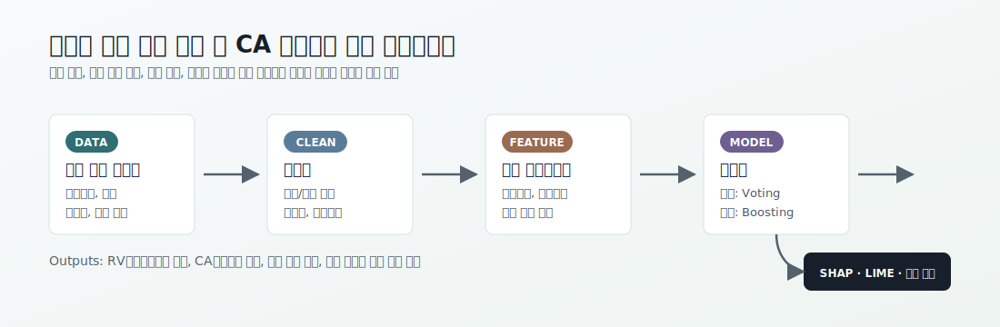

# Credit Revolving & Cash Advance Limit Prediction

신용카드 회원의 이용 행태, 한도 이력, 리볼빙/현금서비스 조건을 바탕으로 **리볼빙 전환 가능 여부**를 분류하고 **CA(현금서비스) 한도금액**을 예측한 금융 머신러닝 프로젝트입니다.

이 프로젝트의 핵심은 단순히 높은 예측 성능을 만드는 데 있지 않습니다. 고객의 현재 한도, 과거 한도 변화, 이용금액, 이자율, 전환 가능 여부가 어떤 방식으로 금융 접근성과 리스크를 설명하는지 모델링하고, 그 결과를 해석 가능한 형태로 정리하는 데 목적이 있습니다.



## 프로젝트 개요

| 구분 | 내용 |
| --- | --- |
| 주제 | 리볼빙 전환 가능 여부 분류 및 CA 한도금액 회귀 예측 |
| 데이터 | 2018년 7월 카드 회원 통합 데이터 |
| 주요 타깃 | `RV전환가능여부`, `CA한도금액` |
| 접근 방식 | EDA, 전처리, 피처 엔지니어링, 불균형 분류, 회귀 모델링, 모델 해석 |
| 주요 모델 | RandomForest, XGBoost, LightGBM, CatBoost, Voting Ensemble |
| 해석 도구 | Feature Importance, SHAP, LIME, Confusion Matrix, PCA/t-SNE |

## 문제 정의

카드 금융에서 리볼빙과 현금서비스 한도는 고객 편의성과 리스크 관리가 동시에 걸린 의사결정 영역입니다. 따라서 본 프로젝트는 두 가지 질문을 중심으로 설계했습니다.

1. 고객이 리볼빙 전환 가능 상태인지 예측할 수 있는가?
2. 고객의 CA 한도금액은 어떤 변수 조합으로 설명할 수 있는가?

분류 모델은 전환 가능 여부의 불균형 문제를 고려해 Macro F1을 주요 지표로 보았고, 회귀 모델은 한도금액의 설명력과 오차 규모를 함께 확인하기 위해 R2, MSE, MAE, RMSE를 사용했습니다.

## 데이터와 전처리

원천 데이터는 인구통계, 카드 보유/이용 정보, 한도 및 이자율, 리볼빙/카드론 관련 변수, 최근 한도 변동 이력 등으로 구성됩니다. 저장소에는 구조 확인용 샘플 CSV가 포함되어 있으며, 노트북 출력에는 전체 데이터 기준 실험 결과가 남아 있습니다.

전처리 단계에서는 다음 작업을 수행했습니다.

- 결측치가 많은 컬럼과 중복 기준년월 컬럼 제거
- 발급회원번호 등 식별성 컬럼 제거
- 연령대, 지역, Life Stage 등 범주형 변수 인코딩
- 이진 변수와 연속형 변수를 구분한 스케일링
- 한도, 이자율, 이용금액, 카드 보유 정보 등 도메인별 피처 그룹 시각화

## 피처 엔지니어링

모델이 금융 행태를 더 잘 설명하도록 기존 변수에서 파생 피처를 구성했습니다.

| 파생 피처 | 의미 |
| --- | --- |
| `한도_대비_사용비율` | 부여된 CA 한도 대비 실제 이용 규모 |
| `이자율_한도_상호작용` | 리볼빙 이자율과 CA 한도의 결합 효과 |
| `한도_증감율` | 최근 한도 대비 현재 한도의 변화 방향 |
| `카드이용한도_평균` | 최근 2개월과 현재 한도를 이용한 안정적 한도 수준 |
| `상향가능여부` | 추가 한도 상향 가능성의 존재 여부 |
| `감액강도` | 강제 한도감액 빈도와 경과월을 함께 반영한 리스크 신호 |

이 피처들은 금융 상품 이용 가능성을 고객의 단면 정보가 아니라 **한도 변화와 이용 압력의 관계**로 해석하려는 시도입니다.

## 모델링

### 분류: 리볼빙 전환 가능 여부

분류 노트북에서는 RandomForest, XGBoost, LightGBM, CatBoost를 비교하고, 최종적으로 Soft Voting Ensemble을 구성했습니다. 클래스 불균형을 보정하기 위해 SMOTE 실험을 수행했으며, 정확도만으로 모델을 판단하지 않기 위해 Macro F1을 함께 사용했습니다.

주요 결과는 다음과 같습니다.

| 지표 | 결과 |
| --- | ---: |
| Accuracy | 0.9540 |
| Macro F1 | 0.9161 |
| Macro Precision | 0.91 |
| Macro Recall | 0.92 |

전환 가능 클래스가 다수인 데이터 구조에서도 소수 클래스의 재현율과 F1을 함께 확인해, 모델이 다수 클래스에만 치우치지 않도록 평가했습니다.

### 회귀: CA 한도금액 예측

회귀 노트북에서는 RandomForest, XGBoost, LightGBM, CatBoost 회귀 모델을 비교하고 GridSearchCV로 하이퍼파라미터 튜닝을 수행했습니다. 5-Fold 교차검증 기준으로 XGBoost가 가장 높은 R2와 낮은 오차를 보였습니다.

| 모델 | R2 | MAE | RMSE |
| --- | ---: | ---: | ---: |
| RandomForest | 0.9727 ± 0.0002 | 177,392.67 | 241,336.70 |
| XGBoost | 0.9735 ± 0.0002 | 175,238.63 | 237,785.60 |
| LightGBM | 0.9734 ± 0.0002 | 175,711.53 | 238,389.29 |
| CatBoost | 0.9732 ± 0.0002 | 176,751.45 | 239,262.45 |

회귀 결과는 한도금액이 단일 변수로 결정되기보다 현재 한도, 최근 한도 이력, 이용 가능 여부, 이자율 조건 등이 함께 설명력을 갖는다는 점을 보여줍니다.

## 해석과 시각화

프로젝트는 모델 성능뿐 아니라 결과 해석에도 초점을 두었습니다.

- Feature Importance로 모델별 주요 변수를 비교
- SHAP으로 한도 예측에 영향을 주는 변수 방향성 확인
- LIME으로 개별 예측 사례의 설명 가능성 보완
- PCA/t-SNE로 분류 타깃의 분리 가능성 시각화
- Confusion Matrix로 소수 클래스 예측 오류 확인

이 과정은 금융 도메인에서 중요한 “왜 그런 예측을 했는가”라는 질문에 답하기 위한 장치입니다.

## 프로젝트 구조

```text
.
├── data/
│   └── member_snapshot_201807.csv
├── notebooks/
│   ├── 01_preprocessing_and_eda.ipynb
│   ├── 02_scaling_pipeline.ipynb
│   ├── 03_revolving_classification.ipynb
│   └── 04_ca_limit_regression.ipynb
├── reports/
│   ├── eda_visualizations/
│   └── project_presentation.pdf
├── assets/
│   └── pipeline.svg
└── README.md
```

## 실행 환경

노트북 실행에는 다음 라이브러리가 사용됩니다.

```bash
pip install pandas numpy matplotlib seaborn scikit-learn imbalanced-learn xgboost lightgbm catboost shap lime
```

각 노트북은 `../data/member_snapshot_201807.csv`를 기준 경로로 사용하도록 정리했습니다. 스케일링 노트북의 일부 중간 산출물(`df_t1.csv`, `df_t2.csv`)은 전처리 단계에서 생성되는 데이터프레임을 저장한 뒤 이어서 사용할 수 있습니다.

## 프로젝트 의의

이 프로젝트는 카드 금융 데이터를 대상으로 분류와 회귀 문제를 함께 설계한 엔드투엔드 분석 사례입니다. 리볼빙 전환 가능 여부는 고객 상태를 판별하는 문제로, CA 한도금액은 고객의 한도 수준을 수치적으로 설명하는 문제로 볼 수 있습니다.

포트폴리오 관점에서 이 프로젝트는 다음 역량을 보여줍니다.

- 금융 도메인 변수를 이해하고 예측 문제로 재구성하는 능력
- 불균형 분류 문제에서 Macro F1, SMOTE, 임계값 조정을 활용하는 능력
- 회귀 모델 비교와 교차검증을 통해 안정적인 모델을 선택하는 능력
- SHAP/LIME 등 해석 도구를 사용해 모델 결과를 설명하는 능력
- 전처리, 모델링, 평가, 시각화를 하나의 분석 흐름으로 정리하는 능력
